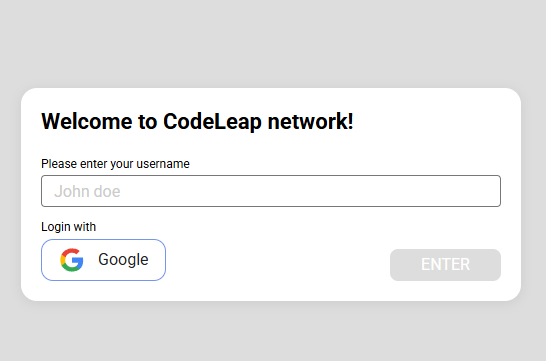
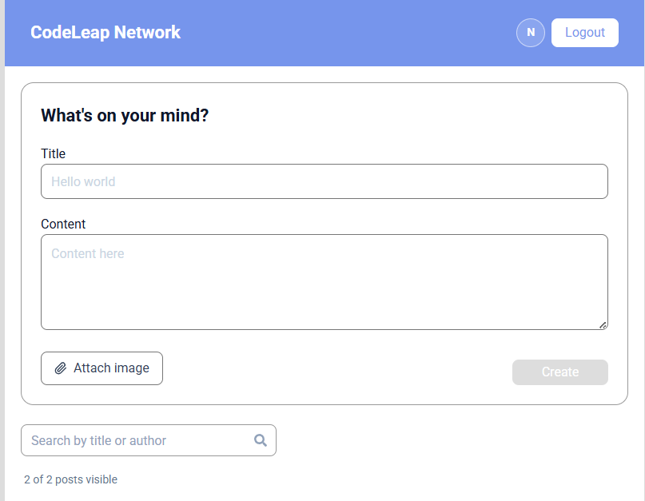
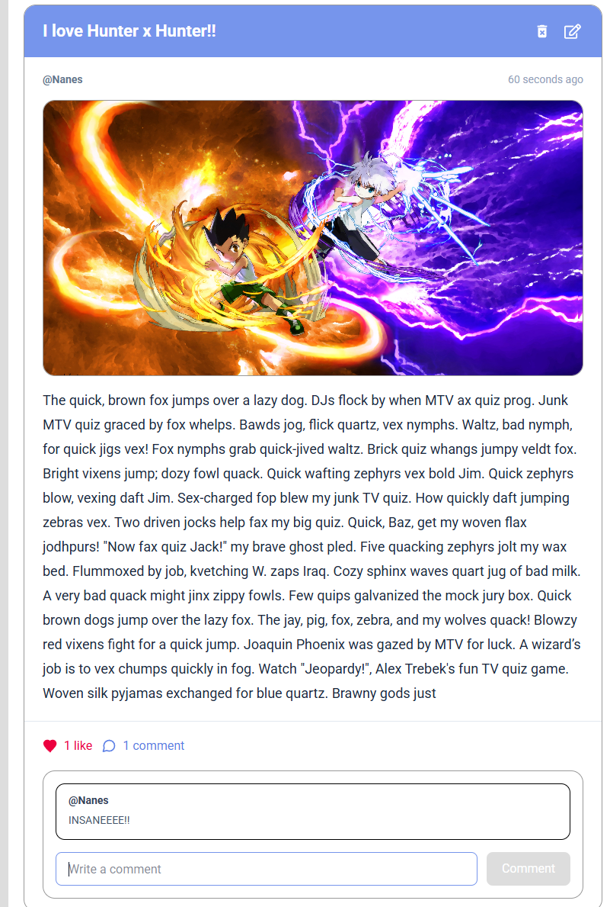

# CodeLeap Network - Frontend Assessment

Este repositório contém a minha solução para o teste técnico de Frontend da CodeLeap. A aplicação simula uma rede social simples com CRUD de posts, autenticação local e uma camada extra de interações mockadas para cobrir os bônus de UI/UX.

O foco da implementação foi manter o fluxo principal fiel ao desafio, com código limpo, responsividade e uma experiência visual consistente.

## Preview

<table align="center">
  <tr>
    <td width="50%" valign="top">
      
      <br />
      
    </td>
    <td width="50%" valign="top">
      
    </td>
  </tr>
</table>

## Tecnologias Utilizadas

- `React + Vite`: estrutura leve, rápida e adequada para uma SPA focada em interações de interface.
- `TypeScript`: tipagem das entidades, payloads, contexto global e hooks.
- `Tailwind CSS`: estilização utilitária com ajustes responsivos e fidelidade visual ao layout proposto.
- `@tanstack/react-query`: cache, sincronização e invalidação automática do estado vindo da API.
- `Axios`: cliente HTTP centralizado para a integração com a API real.
- `Firebase Auth`: opcional, utilizado como bônus para login com Google.

## Arquitetura e Decisões Técnicas

- `Auth gate simples`: se não houver sessão salva, a aplicação exibe a tela de login; se houver sessão, renderiza o feed.
- `Sessão persistida no localStorage`: o fluxo principal do desafio usa username local; o login pelo Google reaproveita a mesma estrutura de sessão.
- `Server state com React Query`: leitura da timeline e mutações do CRUD conectadas à API da CodeLeap com invalidação de cache.
- `Client state mockado`: likes, comentários, menções e anexos são persistidos localmente via Context API + `localStorage`.
- `Camadas separadas`: API, hooks, contextos, tipos e componentes foram organizados por feature para facilitar manutenção.

## Integração com a API Real

Base URL utilizada:

```txt
https://dev.codeleap.co.uk/careers/
```

O CRUD real cobre:
- listar posts
- criar posts
- editar posts
- deletar posts

## Features Implementadas

### Core

- login local com username persistido
- feed com posts mais recentes no topo
- criação de post com validação de campos obrigatórios
- edição e exclusão apenas para posts do usuário logado
- modais de edição e exclusão
- loading, empty state e error state

### Bônus

- login com Google via Firebase Auth, quando configurado
- infinite scroll com `IntersectionObserver`
- filtro local por título ou autor
- animações suaves em modais e estados de hover
- favicon customizado

### Camada Mockada

Algumas funcionalidades não existem na API real, então foram implementadas no front-end com persistência local:

- likes
- comentários
- menções em posts e comentários
- anexos de imagem vinculados ao `post.id`

Esses dados são armazenados localmente na chave:

```txt
codeleap_fake_interactions
```

Quando um post real é deletado, os dados mockados associados a ele também são removidos.

## Como Executar o Projeto

1. Clone o repositório:

```bash
git clone <seu-link-do-github>
cd codeleap-social
```

2. Instale as dependências:

```bash
npm install
```

3. Inicie o ambiente de desenvolvimento:

```bash
npm run dev
```

4. Para gerar a build de produção:

```bash
npm run build
```

## Variáveis de Ambiente

O login com Google é opcional. Para habilitar, crie um arquivo `.env` com base em [`.env.example`](.env.example):

```env
VITE_FIREBASE_API_KEY=
VITE_FIREBASE_AUTH_DOMAIN=
VITE_FIREBASE_PROJECT_ID=
VITE_FIREBASE_APP_ID=
VITE_FIREBASE_STORAGE_BUCKET=
VITE_FIREBASE_MESSAGING_SENDER_ID=
```

Se essas variáveis não estiverem preenchidas:
- a aplicação continua funcionando normalmente com login por username
- o card de login com Google não é exibido

## Firebase Auth (Google)

Para testar o login com Google:

1. Crie um projeto no Firebase
2. Registre um app Web dentro do projeto
3. Ative `Authentication > Sign-in method > Google`
4. Cadastre os domínios autorizados
5. Copie as credenciais do app web para o `.env`


**Observação:** em ambiente publicado, lembre-se de adicionar o domínio da aplicação à lista de domínios autorizados do Firebase.
